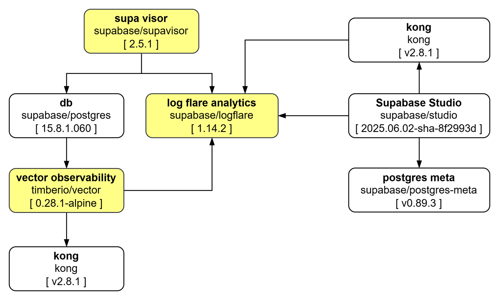

# Documentación Técnica

## Portal y Observabilidad

En el diagrama mostramos la arquitectura de los componentes base de Supabase, plataforma de código abierto para desarrollar aplicaciones. A continuación, describo el propósito y la funcionalidad que aporta cada componente, basándome en el nombre y la versión indicada:

**Componentes resaltados en amarillo (core de Supabase o componentes clave):**

* **Supa Visor (supabase/supavisor [ 2.5.1 ])**
    * **Propósito:** Supavisor es un pooler de conexiones de PostgreSQL desarrollado por Supabase.
    * **Funcionalidad:** Permite gestionar y reutilizar conexiones a la base de datos PostgreSQL, lo que es crucial para la escalabilidad y eficiencia de las aplicaciones. Reduce la sobrecarga de establecer nuevas conexiones para cada solicitud, mejorando el rendimiento y la capacidad de la base de datos para manejar un gran número de clientes concurrentes.

* **db (supabase/postgres [ 15.8.1.060 ])**
    * **Propósito:** Este es el componente central de la base de datos relacional.
    * **Funcionalidad:** Proporciona la base de datos PostgreSQL donde se almacenan todos los datos de la aplicación, incluyendo tablas, vistas, funciones, etc. Es el motor de persistencia de datos para Supabase.

* **log flare analytics (supabase/logflare [ 1.14.2 ])**
    * **Propósito:** Logflare es una herramienta de agregación y análisis de logs.
    * **Funcionalidad:** Recopila, centraliza y permite analizar los logs generados por los diferentes componentes de la arquitectura. Esto es esencial para la depuración, monitoreo del rendimiento, auditoría y comprensión del comportamiento de la aplicación y la infraestructura.

* **vector observability (timberio/vector [ 0.28.1-alpine ])**
    * **Propósito:** Vector es una herramienta de pipeline de datos observacionales (logs, métricas, trazas).
    * **Funcionalidad:** Actúa como un agente ligero para recolectar, transformar y enrutar datos de telemetría (principalmente logs en este contexto de "observability") desde varias fuentes hacia destinos como sistemas de análisis de logs, bases de datos de métricas, etc. Contribuye a la observabilidad general del sistema.

* **kong (kong [ v2.8.1 ]) (Aparece dos veces, lo que podría indicar redundancia o instancias separadas para diferentes propósitos)**
    * **Propósito:** Kong es una API Gateway de código abierto.
    * **Funcionalidad:** Actúa como un punto de entrada unificado para todas las solicitudes a la API. Proporciona funcionalidades clave como enrutamiento de API, autenticación, autorización, limitación de tasas, almacenamiento en caché, monitoreo y transformación de solicitudes. Es fundamental para la seguridad y la gestión del tráfico de las API.

* **Supabase Studio (supabase/studio [ 2025.06.02-sha-8f2993d ])**
    * **Propósito:** Es la interfaz de usuario web para gestionar tu proyecto Supabase.
    * **Funcionalidad:** Proporciona una consola visual para interactuar con la base de datos, gestionar tablas, ejecutar consultas SQL, ver logs, configurar autenticación, gestionar almacenamiento de archivos, y más. Es la herramienta principal para los desarrolladores que trabajan con Supabase. La fecha en la versión (`2025.06.02`) es interesante, podría ser una versión de desarrollo o una fecha de compilación.

* **postgres meta (supabase/postgres-meta [ v0.89.3 ])**
    * **Propósito:** Postgres-meta es una API RESTful para gestionar tu base de datos PostgreSQL.
    * **Funcionalidad:** Proporciona una capa de abstracción sobre PostgreSQL, permitiendo a Supabase Studio y otros servicios interactuar programáticamente con la base de datos para realizar operaciones como la introspección del esquema, gestión de roles, creación de tablas, etc., sin necesidad de interactuar directamente con el cliente SQL.

La arquitectura describe un entorno Supabase, donde **PostgreSQL** es la base de datos principal, **Supavisor** gestiona las conexiones, **Kong** maneja las API, **Logflare** y **Vector** se encargan de la observabilidad y los logs, y **Supabase Studio** junto con **Postgres-meta** proporcionan las herramientas de gestión y la interfaz de usuario.

##

La imagen presenta un diagrama de arquitectura simplificado que parece enfocarse en los componentes de autenticación, base de datos y envío de correos electrónicos dentro de un ecosistema Supabase. A continuación, describo el propósito y la funcionalidad de cada componente:

Componentes resaltados en amarillo (componentes externos o específicos):

* mail server [ smtp ]

  * Propósito: Un servidor de correo electrónico genérico que utiliza el Protocolo Simple de Transferencia de Correo (SMTP).

  * Funcionalidad: Es responsable de enviar correos electrónicos transaccionales o de notificación. En el contexto de Supabase, esto es crucial para funcionalidades como la confirmación de correo electrónico después de un registro, restablecimiento de contraseñas, notificaciones de cambios de correo electrónico, etc., que son manejadas por el servicio de autenticación.

* log flare analytics (supabase/logflare [ 1.14.2 ])

 * Propósito: Logflare es una herramienta de agregación y análisis de logs.

 * Funcionalidad: Recopila, centraliza y permite analizar los logs generados por los otros componentes de la arquitectura, como gotrue y db. Esto es vital para la depuración, monitoreo de errores, seguimiento de eventos de seguridad (ej. intentos de inicio de sesión fallidos), y comprender el comportamiento de los servicios.

Componentes en blanco (componentes principales de Supabase):

* gotrue (supabase/gotrue [ v2.174.0 ])

 * Propósito: GoTrue es el servicio de autenticación de código abierto desarrollado por Supabase.

 * Funcionalidad: Gestiona la autenticación de usuarios para las aplicaciones. Esto incluye:

Registro de usuarios (con correo electrónico/contraseña, proveedores OAuth, etc.).

Inicio de sesión y gestión de sesiones.

Restablecimiento de contraseñas.

Confirmación de correo electrónico.

Gestión de tokens de acceso (JWT).

Integración con políticas de seguridad a nivel de fila (RLS) en PostgreSQL.
Es el cerebro detrás de la identificación y autorización de los usuarios que interactúan con tu aplicación y base de datos.

* db (supabase/postgres [ 15.8.1.060 ])

 * Propósito: Este es el componente central de la base de datos relacional.

 * Funcionalidad: Proporciona la base de datos PostgreSQL donde se almacenan todos los datos de la aplicación. En el contexto de este diagrama, gotrue almacenaría los datos de los usuarios (hashes de contraseñas, correos electrónicos, etc.) en esta base de datos. Además, es donde se almacenarían todos los demás datos de tu aplicación. El ícono del cilindro representa la persistencia de los datos.

En resumen, esta arquitectura muestra cómo GoTrue maneja la autenticación y el envío de correos (a través del mail server), almacenando los datos de usuario en la base de datos PostgreSQL, mientras que Logflare se encarga de la observabilidad y el análisis de los eventos generados por estos servicios.

